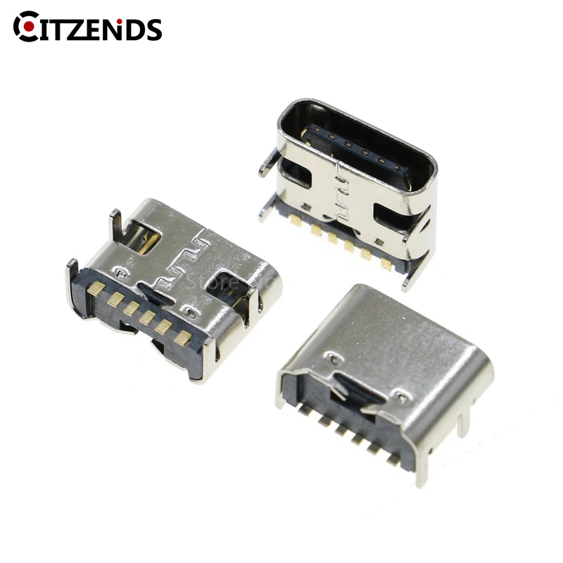
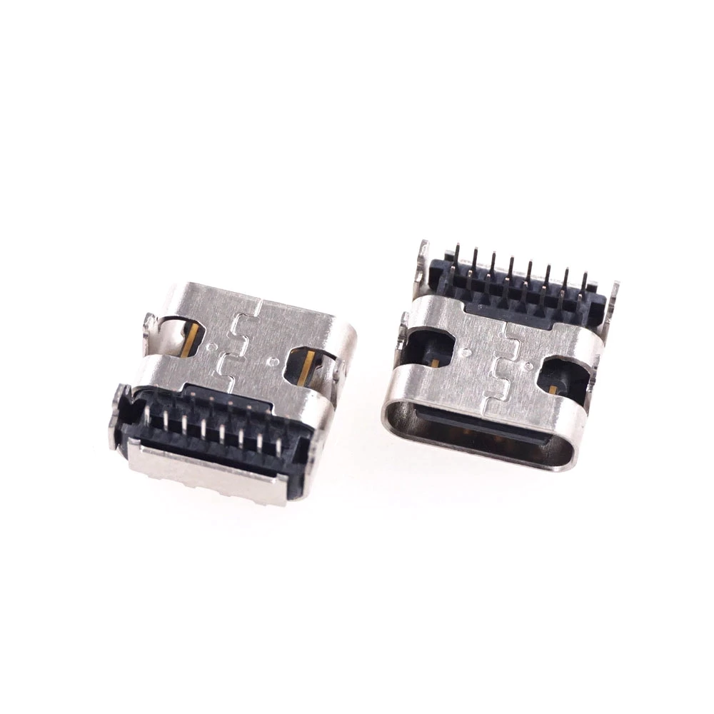
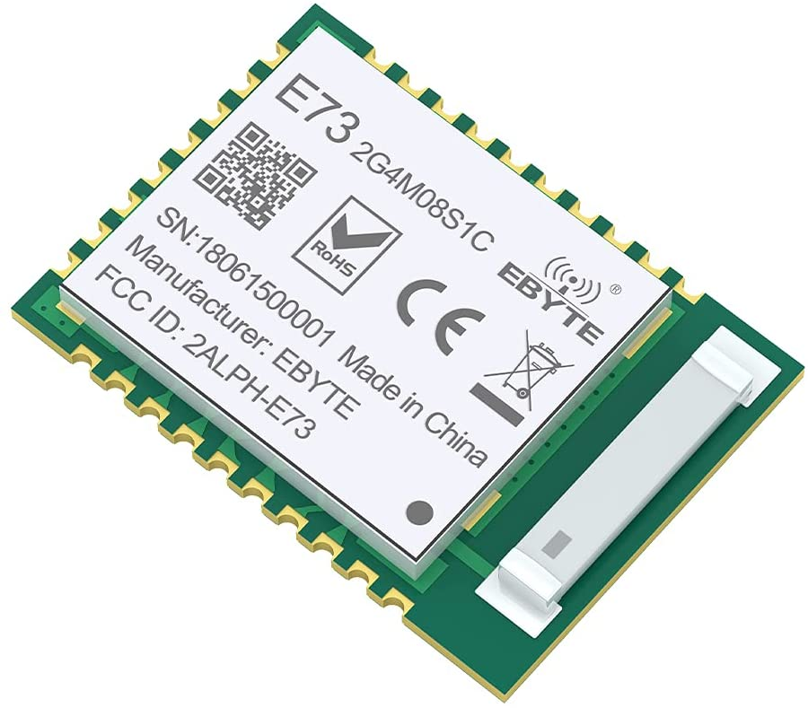
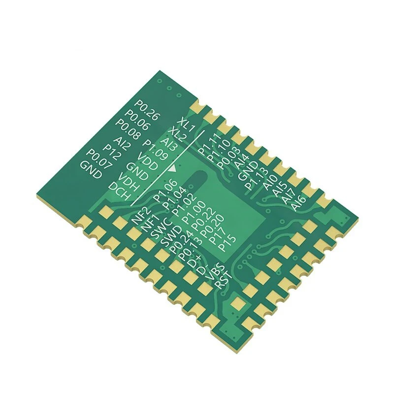
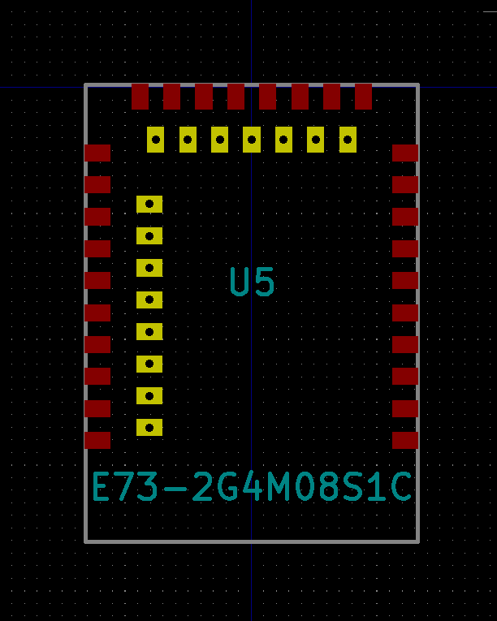

# PCB design best practices

## USB C
Soldering a 16-pin USB C 16-Pin SMT receptacle is very difficult.
6-pin SMT or 16-pin through hole is a better choice:

| 6-pin SMT | 16-pin THT | 
| :-------------: |:-------------:| 
|  |  | 

## Underside Pads
Consider the popular nRF52840 E73-2G4M08S1C module.
It has a small footprint aided by the pads underneath.
This can be hand solderable by having holes through the PCB.
The holes should be as large as possible, the ones in the footprint here were too small.

| Top | Bottom | Footprint |
| :---: | :---: | :---:|
|  |  |  |

I would recommend using modules with just castellated edges.

## Useful Resources
- https://github.com/rafaeldelboni/buildlogs/blob/main/torn-v3.md
- https://github.com/hsgw/plaid